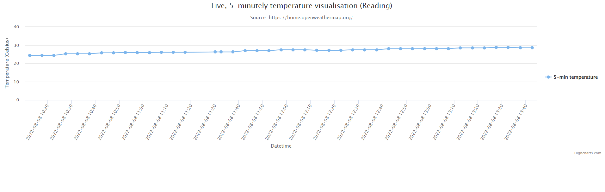

# highcharts_flask_example
An example Flask web application used to display live, 5-minutely API data using HighCharts.js

* Developed and tested in Python 3.8+

## How do I get set-up?

* Generate an API key at https://openweathermap.org/api and update the ajax request in the graph.js script.
* Install the dependencies by running ```pip install -r "requirements.txt"``` at the top level of the directory.
* Run the ```launch_flask.ps1``` powershell script to launch the app.

## Example


